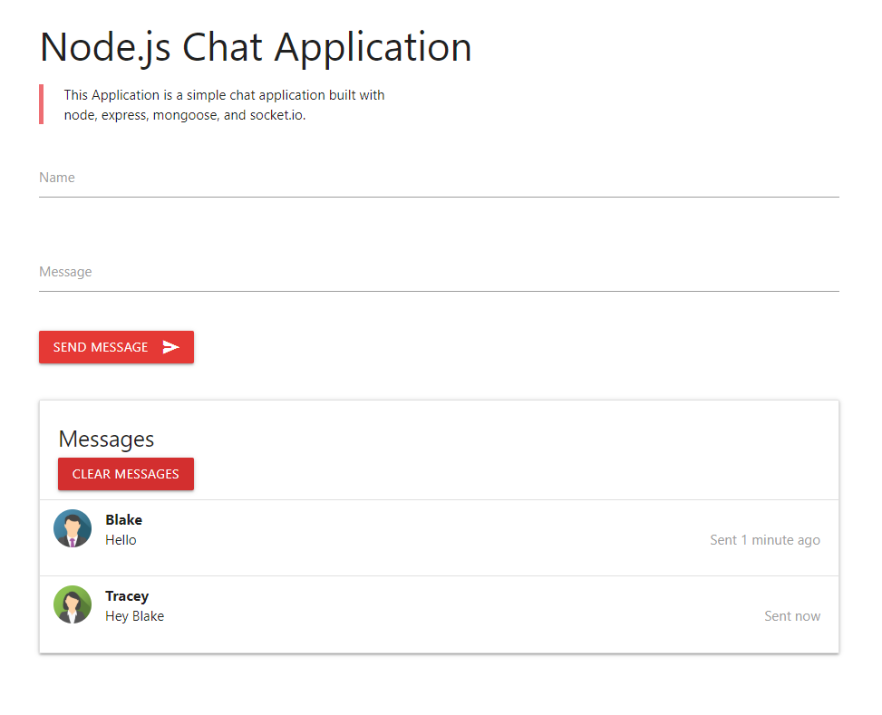

## Basic Chat App

This project is a simple chat application built with node, express, mongoose and socket.io.

### Functionality
It allows users to send messages that are then stored in a mongodb database.

As it uses socket.io, when you send a message it automatically gets added on to the page and there is no need to refresh.

There is also a clear messages button that deletes all messages.

### Design

The ui is built with MaterializeCSS. It has a clean and simple design.

